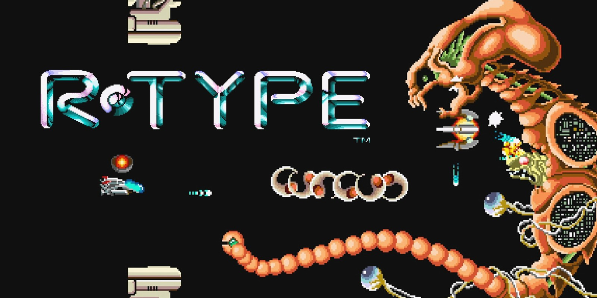

# R-TYPE

<!--  -->
[](https://www.youtube.com/watch?v=pVWtI0426mU&ab_channel=WorldofLongplays)

## Link to the full documentation

Documentation is available [here](https://lucas99913.github.io/Doc-RType/)

## Installation

To begin with, in order to use the project, you need to clone it using the following command:

```sh
git clone git@github.com:EpitechPromo2027/B-CPP-500-MAR-5-2-rtype-theo.berget.git
```

Once you have obtained the project, navigate to it to install the dependencies.

### Linux and MacOs version

To install the project you can use the following command at the root of the project:

```sh
./Linux_MacOS_Build.sh
```

if the build folder already exists, use the following command to rebuild the project:

```sh
./Linux_MacOS_Build.sh all
```

### Windows version

To install the project you can use the following command at the root of the project:

```sh
./Windows_Build.bat
```

if the build folder already exists, use the following command to rebuild the project:

```sh
./Windows_Build.bat all
```

### Warning

You may encounter an error during the execution of this command. If this is the case, you must execute the following command:

```sh
conan config home
```

then add the following lines to the global.conf file in folder that was returned by the previous command:

```sh
tools.system.package_manager:mode=install
tools.system.package_manager:sudo=True
```

If you encounter other errors, refer to our [documentation](mettre le lien).

## Usage

### Server

To launch the server, you must execute the following command:

```sh
./r-type_server [PUBLIC_IP_OF_THE_SERVER (default: 127.0.0.1)] [PORT (default: 6000)]
```

### Client

To launch the client, you must execute the following command:

```sh
./r-type_client [YOUR_IP] [PORT]
```

## Contributors

- [Lucas Giorsetti](https://github.com/Lucas99913)
- [Théo Berget](https://github.com/theo-wq)
- [Noam Bouriche](https://github.com/Noam044)
- [Rayan Bahri](https://github.com/Rvvyynn)

## License

This project is licensed under the MIT License - see the [LICENSE](LICENSE.md) file for details
