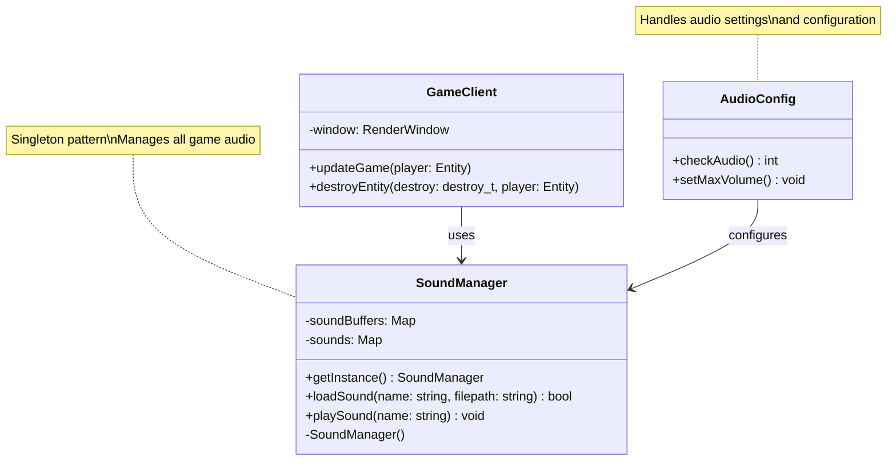
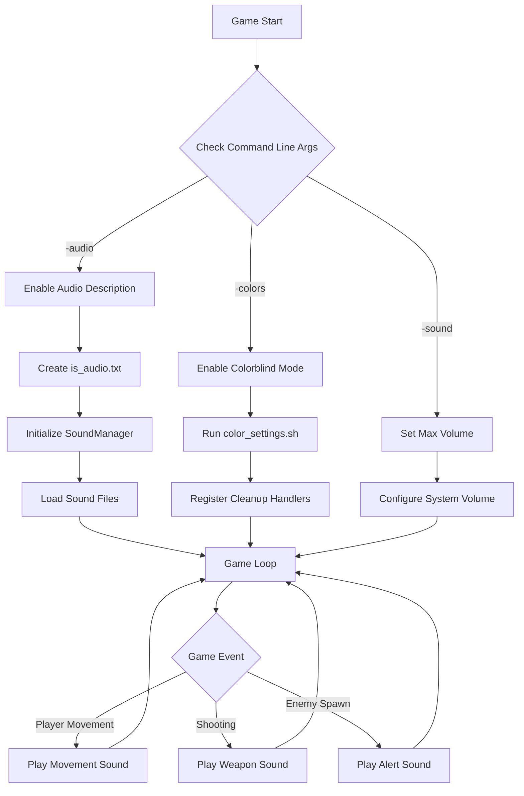
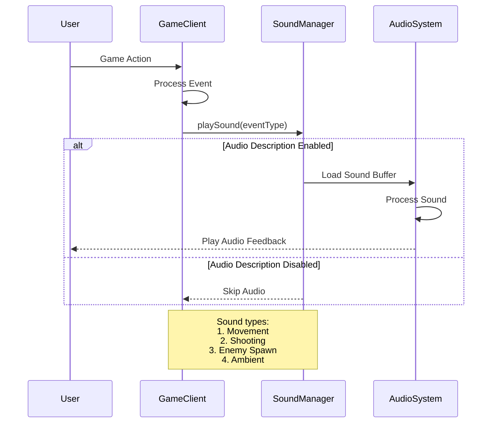

# Accessibility Features

## System Architecture

### Audio System Architecture

The following diagram shows how the audio system is structured and how it interacts with different parts of the game:



### Accessibility Feature Flow

This diagram illustrates how accessibility features are initialized and managed during game execution:



### Event Sound Sequence

The following sequence diagram shows how game events trigger audio feedback:



## Audio Features

### Audio Description Mode

- Activated via `-audio` command line flag
- Provides audio cues for game events:
  - Shooting sounds
  - Movement feedback
  - Enemy appearance notifications
  - Lobby ambiance

### Enhanced Audio Support

- Maximum volume setting via `-sound` flag
- Clear distinct sounds for different game events
- Audio feedback for all major game actions

## Visual Accessibility

### Colorblind Mode

- Activated via `-colors` command line flag
- Modifies game colors for better visibility
- Automatic restoration of default colors on game exit
- Graceful cleanup handling for unexpected termination

## Command Line Options

```bash
./r-type_client [options]
Options:
  -audio    Enable audio descriptions
  -colors   Enable colorblind mode
  -sound    Set maximum volume
```

## Implementation Details

### Audio System

- Uses SFML Audio system
- Managed through SoundManager singleton
- Sound files located in `sound_board/`:
  - Tire.wav: Shooting effects
  - Déplacement.wav: Movement sounds
  - Devant.wav: Enemy appearance
  - Lobby.wav: Lobby ambiance

### Audio Configuration

- State stored in `is_audio.txt`
- Runtime toggling of audio features
- Persistent settings between sessions

### Visual Modifications

- Color scheme adjustments through shell script
- Signal handling for proper cleanup
- Support for multiple color vision deficiency types
