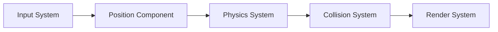
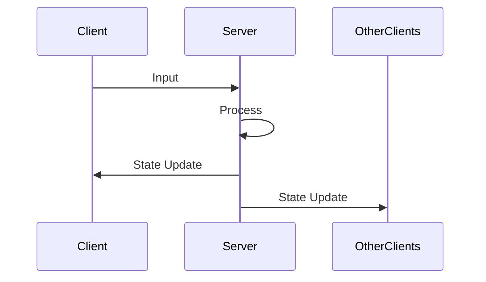

# Architecture

## Entity Component System (ECS)

### Overview

Our ECS architecture separates game logic into three main parts:

1. Entities: Unique identifiers for game objects
2. Components: Data containers (position, velocity, etc.)
3. Systems: Logic processing components

### Core Systems

#### Registry

Central manager handling:
- Entity creation/destruction
- Component addition/removal
- System coordination

```cpp
registry.spawn_entity();
registry.add_component<Position>(entity, {x, y});
```

#### Component Types

- Position
- Velocity
- Drawable
- Collision
- Health
- Weapon

## Network Architecture

### Client-Server Model

- Server: Authoritative game state
- Clients: Input handling and rendering
- UDP-based communication
- Binary protocol for efficiency

### Synchronization

- Server tick rate: 60Hz
- Client prediction
- State reconciliation
- Input validation

## Rendering System

- SFML-based graphics
- Sprite management
- Animation system
- Particle effects

## Audio System

- Sound effects manager
- Music player
- Spatial audio support

## Diagrams

### Component Flow



### Network Flow


