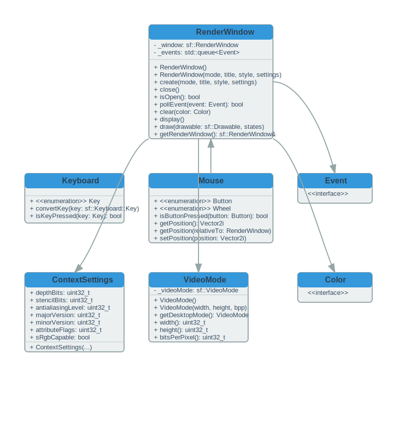

# Engine Features

## Core Systems

### Entity Management

- Dynamic entity creation/destruction
- Component management
- Entity queries
- Lifecycle management

### Physics System

- Collision detection
- Movement handling
- Hitbox management
- Projectile physics

### Rendering

- Sprite rendering
- Animation system
- Particle effects
- Background parallax



### Audio

- Sound effects
- Background music
- Volume control
- Spatial audio

## Game Features

### Player Systems

- Movement control
- Weapon systems
- Power-ups
- Force module

### Enemy Systems

- AI patterns
- Spawn management
- Attack patterns
- Boss behaviors

### Level System

- Stage progression
- Enemy waves
- Background management
- Obstacle placement

## Debug Features

### Console

```cpp
debug.log("Message");
debug.setVariable("playerSpeed", 5.0f);
```

### Visual Debug

- Hitbox visualization
- FPS counter
- Network stats
- Entity inspector

## Accessibility

- Configurable controls
- Visual assistance
- Audio cues
- Difficulty settings
