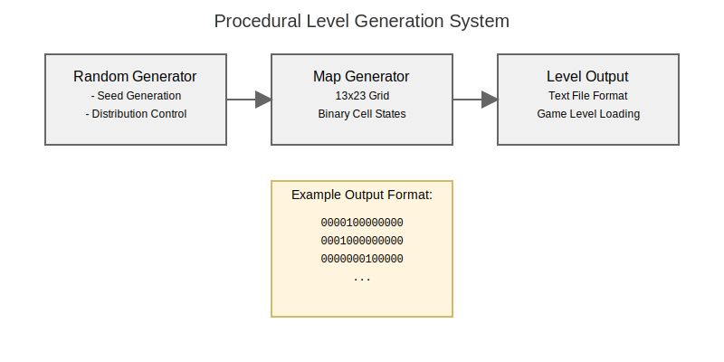
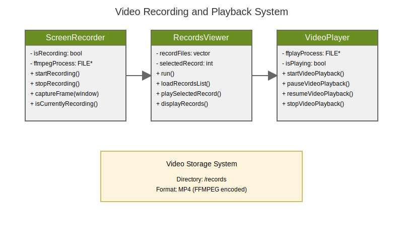

# Engine Features

## Core Systems

### Entity Management

- Dynamic entity creation/destruction
- Component management
- Entity queries
- Lifecycle management

### Physics System

- Collision detection
- Movement handling
- Hitbox management
- Projectile physics

### Rendering

- Sprite rendering
- Animation system
- Particle effects
- Background parallax
- Ship customization rendering
- Video recording and playback:
  - Real-time capture at 30 FPS
  - MP4 format with audio
  - FFMPEG integration
  - Recording browser interface


### Audio

- Enhanced sound system with SoundManager singleton
- Real-time audio feedback for game events
- Configurable volume control with boost options
- Audio description support for accessibility
- Sound categories:
  - Movement feedback
  - Weapon effects
  - Enemy notifications
  - Ambient audio
- Runtime audio toggling
- Video recording audio capture

## Game Features

### Player Systems

- Movement control
- Weapon systems
- Power-ups
- Force module
- Ship customization:
  - Multiple ship variants (4 types)
  - Ship selection interface
  - Visual ship preview
  - Ship skin persistence

### Enemy Systems

- AI patterns
- Spawn management
- Attack patterns
- Boss behaviors

### Level System

- Procedural level generation:
  - Random map generation (13x23 grid)
  - Dynamic obstacle placement
  - Binary cell system (0 empty, 1 obstacle)
  - 1% obstacle probability
- Stage progression
- Enemy waves
- Background management
- Obstacle placement



### Recording System

- Real-time gameplay recording
- Video record management:
  - Auto-organized in /records directory
  - Timestamp-based naming
  - Browser interface
- Video playback features:
  - Play/Pause controls
  - Stop functionality
  - Interactive UI
  - Record selection
- FFMPEG integration



## Debug Features

### Console

```cpp
debug.log("Message");
debug.setVariable("playerSpeed", 5.0f);
```

### Visual Debug

- Hitbox visualization
- FPS counter
- Network stats
- Entity inspector

## Accessibility

- Configurable controls
- Visual assistance:
  - Colorblind mode via `-colors` flag
  - High contrast options
  - Configurable visual effects
  - Ship variant distinction
- Audio features:
  - Enhanced audio descriptions via `-audio` flag
  - Volume boost option via `-sound` flag
  - Event-based sound feedback
  - Runtime audio toggles
- Difficulty settings
- Command line options:
  ```bash
  ./r-type_client [options]
    -audio    Enable audio descriptions
    -colors   Enable colorblind mode
    -sound    Set maximum volume
  ```