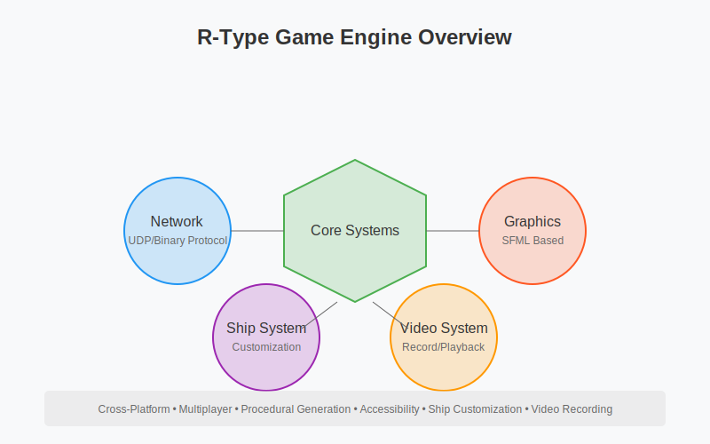

# R-Type Game Engine

Welcome to the R-Type multiplayer game engine documentation. This project implements a networked version of the classic R-Type shoot'em up using a modern Entity Component System architecture.

## Overview

- Multiplayer network gameplay using UDP
- Cross-platform (Linux/Windows)
- Entity Component System architecture
- Custom game engine with modular design
- Advanced features:
  - Ship customization system
  - Video recording and playback
  - Procedural level generation
  - Comprehensive accessibility options

## Documentation Sections

- [Getting Started](getting-started.md) - Build and run instructions
- [Technical Study](technical-study.md) - Language and Tool choices
- [Architecture](architecture.md) - Technical design and systems
- [Network Protocol](network-protocol.md) - Communication specifications
- [Engine Features](engine-features.md) - Core functionalities
- [Ship Customization](ship-customization.md) - Ship selection and customization system
- [Video System](video-system.md) - Recording and playback features
- [Accessibility Guide](accessibility-guide.md) - Accessibility features and setup
- [Contributions](contributions.md) - Development guidelines
- [API Reference](api-reference.md) - Code documentation
- [Protocol RFC](rfc_doc.md) - Protocol specification

## Quick Links

- [Building Instructions](getting-started.md#building)
- [Running the Server](getting-started.md#server)
- [Development Guide](contributing.md#development-guide)

## License

This project is licensed under the [MIT License](LICENSE.md).