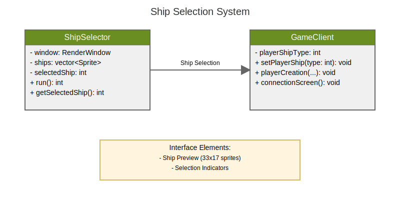

# Ship Customization System

## Overview

The ship customization system allows players to select and customize their R-Type ship appearance from various available skins.



## Components

### ShipSelector Class

```cpp
class ShipSelector {
private:
    gameEngine::RenderWindow &window;
    gameEngine::Font *font;
    gameEngine::Texture *shipTexture;
    std::vector<gameEngine::Sprite> ships;
    std::vector<gameEngine::RectangleShape> selections;
    gameEngine::Text title;
    int selectedShip;
    bool selectionMade;
    
    static const int SHIP_COUNT = 4;
    static const int SHIP_WIDTH = 33;
    static const int SHIP_HEIGHT = 17;

public:
    ShipSelector(gameEngine::RenderWindow &win);
    ~ShipSelector();
    int run();
};
```

### Technical Specifications

- Ship Sprite Dimensions: 33x17 pixels
- Available Ships: 4 variants
- Scale Factor: 3.0 for display
- Selection Border: 2px thickness

## User Interface

### Visual Elements
- Ship previews displayed horizontally
- Selection indicator around current choice
- Title text "SELECT YOUR SHIP"
- Visual feedback on selection

### Controls
- Left/Right arrows to navigate
- Mouse click to select
- Enter to confirm selection
- Selection highlight in yellow
- Non-selected ships bordered in blue

## Integration

### Menu Integration
```cpp
if (pos == 1) {  // Multiplayer option
    ShipSelector selector(window);
    int selectedShip = selector.run();
    if (selectedShip != -1) {
        GameClient cli(window);
        cli.setPlayerShip(selectedShip);
        cli.connectionScreen();
    }
}
```

### Game Client Integration
```cpp
void GameClient::playerCreation(player_t position, Entity &player, bool isSelf) {
    if (isSelf) {
        position.player_sprite = playerShipType;
    }
    component::Sprite sprite(sf::IntRect(PLAYER_WIDTH * 2, 
        PLAYER_HEIGHT * position.player_sprite + 2, 
        PLAYER_WIDTH, PLAYER_HEIGHT));
    // ...
}
```

## Asset Requirements

### Texture Files
- Location: `assets/RType/sprites/ship.png`
- Format: Sprite sheet containing all ship variants
- Resolution: Multiple of 33x17 pixels

### Font Files
- Location: `assets/RType/font/r-type.ttf`
- Usage: Selection screen text

## Implementation Details

### Sprite Sheet Layout
- Each ship variant occupies 33x17 pixels
- Vertical arrangement of variants
- Base offset of 2 pixels for proper alignment

### Selection Logic
- Real-time preview updating
- Persistent selection storage
- Error handling for invalid selections
- Seamless menu integration