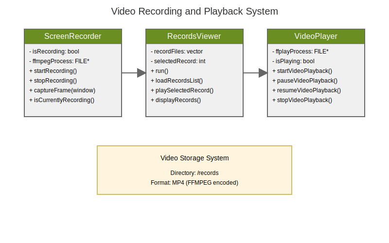

# Video Recording and Playback System

## Overview

The R-Type game engine includes a comprehensive video recording and playback system that allows players to record their gameplay sessions and review them later.



## Components

### ScreenRecorder

The ScreenRecorder class handles real-time capture of gameplay:

```cpp
class ScreenRecorder {
public:
    void startRecording();
    void stopRecording();
    void captureFrame(gameEngine::RenderWindow& window);
    bool isCurrentlyRecording() const;
private:
    void processFrames();
    // Internal state management
    std::atomic<bool> isRecording;
    FILE* ffmpegProcess;
    // Frame processing
    std::queue<std::shared_ptr<sf::Texture>> frameBuffer;
    std::mutex framesMutex;
    std::condition_variable frameCondition;
};
```

### RecordsViewer

Interface for browsing and selecting recorded gameplay sessions:

```cpp
class RecordsViewer {
public:
    RecordsViewer(gameEngine::RenderWindow& window);
    void run();
private:
    void loadRecordsList();
    void displayRecords();
    void handleEvents();
    void playSelectedRecord(const std::string& filename);
};
```

### VideoPlayer

Controls playback of recorded sessions:

```cpp
class VideoPlayer {
public:
    VideoPlayer(gameEngine::RenderWindow& window, const std::string& filename);
    void run();
private:
    void startVideoPlayback();
    void pauseVideoPlayback();
    void resumeVideoPlayback();
    void stopVideoPlayback();
};
```

## Technical Specifications

### Recording
- Format: MP4
- Framerate: 30 FPS
- Resolution: Window resolution (default 1920x1080)
- Audio: Synchronized game audio capture
- Storage: `/records` directory
- Naming: Timestamp-based unique identifiers

### Playback
- FFMPEG integration for video decoding
- Full playback controls
- Menu integration
- Interactive UI with hover effects
- Support for multiple video formats

## User Interface

### Records Browser
- List view of available recordings
- Preview functionality
- Click-to-play interaction
- Sorting by date/name
- ESC to return to menu

### Playback Controls
- Play/Pause button
- Stop button
- Return to menu option
- Visual feedback on hover
- Keyboard shortcuts

## Implementation Details

### Recording Process
1. Capture frames at 30 FPS
2. Buffer frames in memory
3. Process frames through FFMPEG
4. Save to MP4 file with timestamp

### Playback Process
1. Load video file
2. Initialize FFMPEG playback
3. Handle user input
4. Manage playback state
5. Clean up resources on exit

## File Management

### Directory Structure
```
records/
  ├── recording_[timestamp].mp4
  └── ...
```

### Naming Convention
- Format: `recording_[unix_timestamp].mp4`
- Automatic increment for duplicate timestamps
- Built-in conflict resolution

## Integration

### Menu Integration
```cpp
else if (pos == 3) {
    RecordsViewer recordsViewer(window);
    recordsViewer.run();
}
```

### Recording Controls
- R key to start/stop recording
- Automatic file management
- Error handling and recovery
- Resource cleanup

## Dependencies

- FFMPEG for video encoding/decoding
- SFML for window management and rendering
- Standard C++ libraries for file management